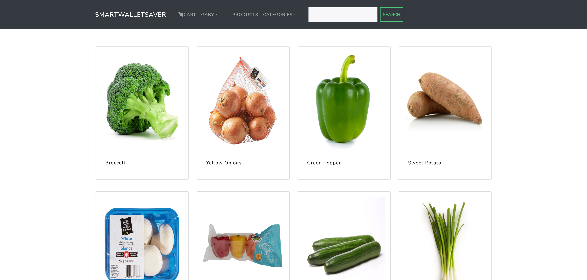
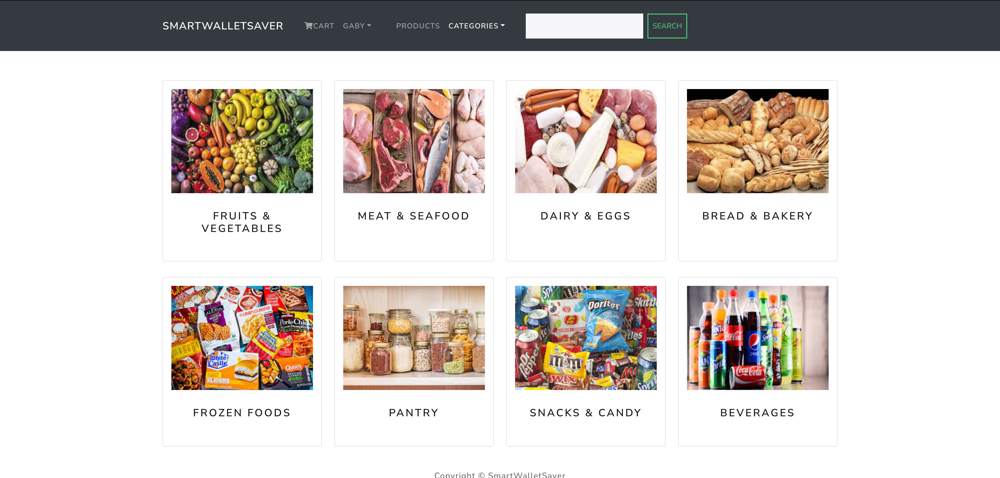
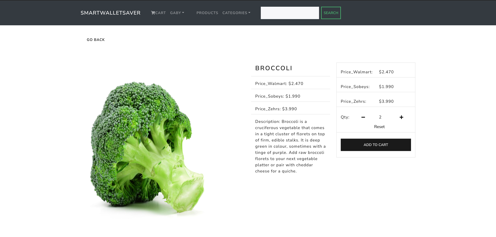
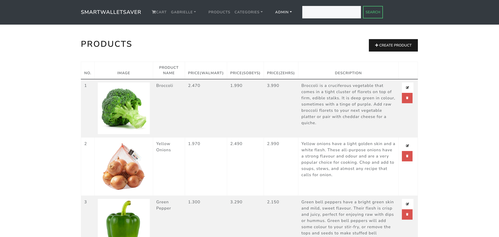
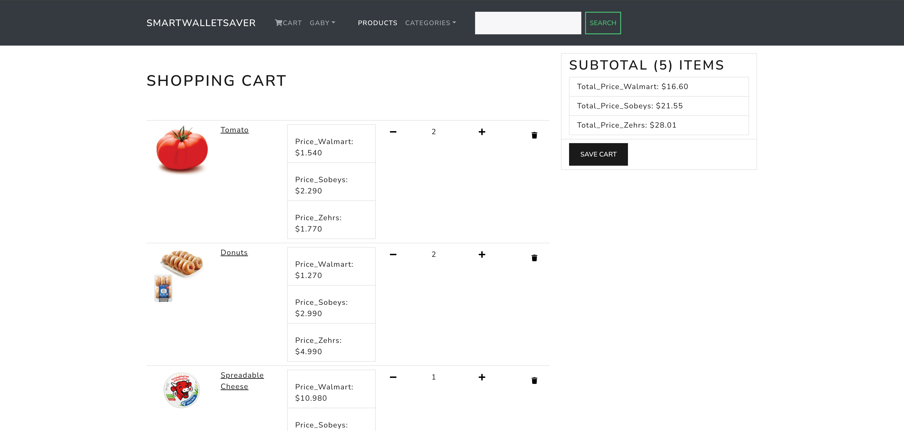
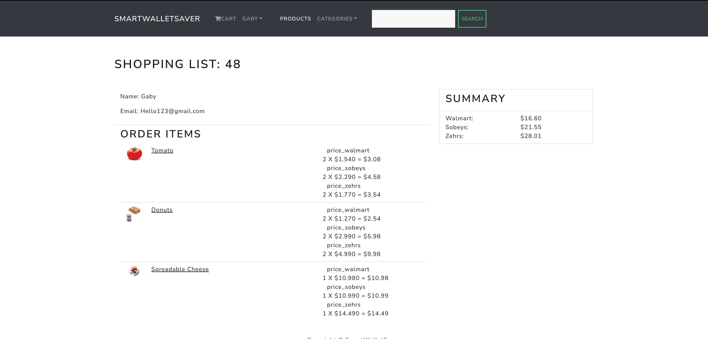
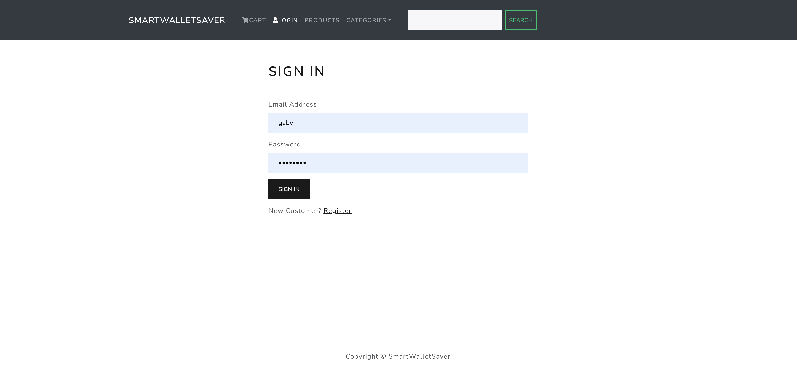
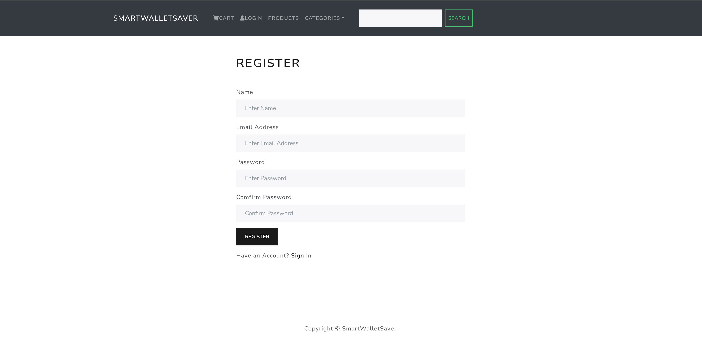
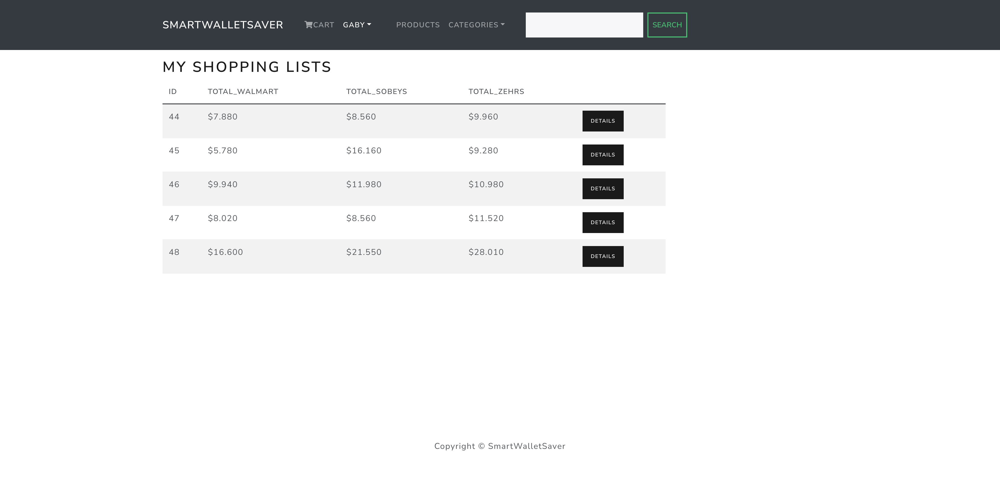

# Smart Wallet Saver

The quote “A penny saved is a penny earned” by Benjamin Franklin is the key motivation behind “Smart Wallet Saver”. It is a full stack web application where users make a grocery shopping list on the application. The total price of the shopping list is compared through 3 grocery shopping outlets (Walmart, Zehrs and Sobeys) and a price comparison is made. The web application then recommends the shopping outlet with the cheapest bill.
## Framework Used
- Django (For backend)
- Reactjs (For frontend)
- Cloud Postgres (For Database)

## 📷 ScreenShots

## ✅ Prerequisites

## 💾 Installation

### Backend

### Frondend

## 🖇 Thanks to
